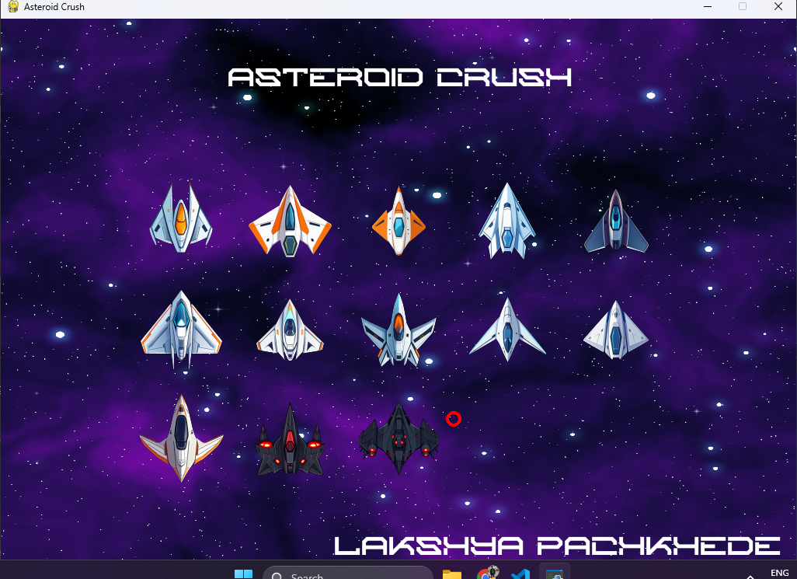
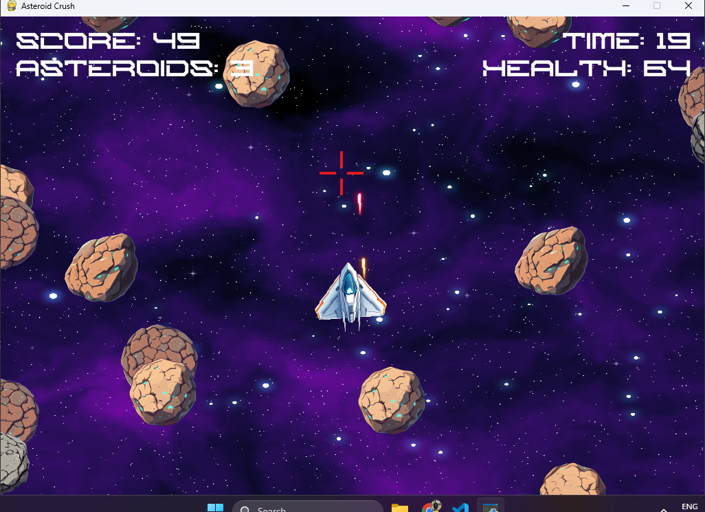
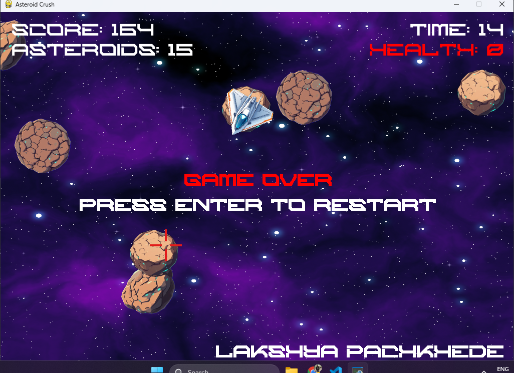

# Asteroid Crush 

**Asteroid Crush** is a fast-paced top-down space shooter built with **Python** and **Pygame**.
The objective is simple: **survive as long as possible while destroying incoming asteroids**.

This project was developed in approximately **4 hours** as a rapid prototype focusing on core gameplay mechanics, basic polish, and a clean game loop architecture.

---

# Screenshots

## Start Menu


## Gameplay


## Game Over



# Gameplay

You control a spaceship placed in the center of space. Asteroids continuously spawn and move toward you.
Destroy them with your laser before they collide with your ship.

Your score increases based on:

* **Time survived**
* **Asteroids destroyed**

Try to beat your **high score** each run.

---

# Features

* 🚀 **13 selectable spaceships** from the main menu
* 🎯 **Mouse-aimed shooting**
* 💥 **Animated asteroid explosions**
* 🎵 **Background music and explosion sound effects**
* 🖥 **Custom game font**
* 📊 **Score system**

  * Survival time
  * Asteroids destroyed
* 🏆 **Persistent high score system**
* 🧭 **Main menu with ship selection**
* ☠ **Game over screen with restart**

---

# Controls

| Action              | Control               |
| ------------------- | --------------------- |
| Move                | **W A S D**           |
| Aim                 | **Mouse**             |
| Shoot               | **Left Mouse Button** |
| Restart (Game Over) | **Enter**             |
| Exit Game           | **Esc**               |

---

# How to Run

### Requirements

* Python 3.9+
* Pygame

Install dependencies:

```bash
pip install pygame
```

Run the game:

```bash
python main.py
```

---

# Project Structure

```
Asteroid-Crush/
│
├── main.py
├── game.py
├── player.py
├── asteroid.py
├── bullet.py
├── explosion.py
├── settings.py
│
├── assets/
│   ├── img/
│   │   ├── ships/
│   │   ├── explosion.png
│   │   ├── bg.png
│   │   └── aim.png
│   │
│   ├── sound/
│   │   ├── explosion.ogg
│   │   └── bg.mp3
│   │
│   └── font/
│       └── font.otf
│
└── highscore.txt
```

---

# Development Notes

This project was intentionally kept simple to focus on:

* Core **game loop architecture**
* **Entity management**
* **Collision detection**
* **Sprite animation**
* **Input handling**
* **Sound integration**

Advanced effects such as:

* particle systems
* camera shake
* physics-based movement

were intentionally not included in order to keep the prototype small and completed within a short development time(4 hours).

---

# Assets Used

1. https://opengameart.org/content/assets-free-laser-bullets-pack-2020
2. https://www.fontspace.com/category/gaming
3. https://epesami.itch.io/small-explosion-audio-pack
4. https://squaremeapixel.itch.io/space-pack
5. https://mattwalkden.itch.io/lunar-battle-pack
6. https://screamingbrainstudios.itch.io/seamless-space-backgrounds

All assets belong to their respective creators.

---

# Future Improvements

Potential upgrades for future versions:

* Particle effects for explosions and thrusters
* Screen shake during asteroid impacts
* Increasing difficulty over time
* Asteroid splitting mechanics
* Powerups (rapid fire, shields, etc.)
* Leaderboard system
* Controller support

---

# Author

Developed by **Lakshya Pachkhede**.

---

# License

This project is provided for learning and experimentation purposes.
Please refer to individual asset sources for their respective licenses.
